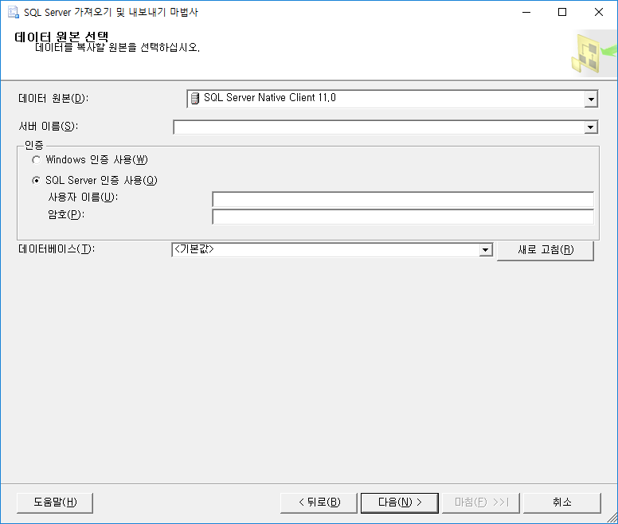
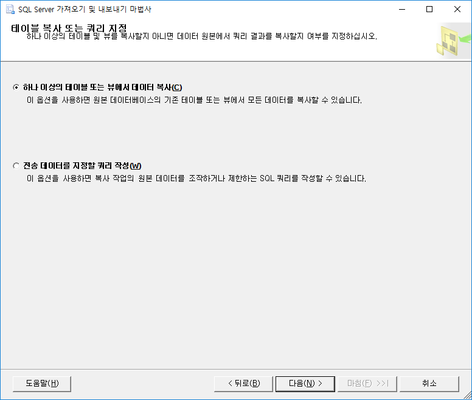

# 데이터베이스 / 데이터 복사하기
- 방법 1. 백업파일
  + 버전 같아야함. 그래서 다른 서버간에는 잘 안씀
- 방법 2. 엑셀 / 스크립트(쿼리)로
  + 데이터가 약 10000건 이하로 적을 경우
  + 엑셀
    * 주로 컨버전
    * 태스크 - 데이터 가져오기에서 엑셀 선택. 엑셀 버전 확인!
  + 스크립트 생성 방법
    * 태스크 - 스크립트 생성
    * 인덱스, 프로시저 등등 까지 한꺼번에!
- 방법 3. 서버끼리 통신하는 링크드방식(포트)
  + 제일 많이 사용
## 방법 3으로 데이터 복사하기
1. 옮길 원본이 존재하는 서버의 ip주소, 인증 란에는 SQL 서버 정보를 넣고, 데이터베이스를 선택한다. 같은 서버에 있다면, Windows 인증 사용으로.
  

2. 가져올 서버의 ip주소 등을 입력하고, 데이터베이스를 선택
  

3. 데이터 복사 선택
  

4. 매핑될 테이블을 선택하고 대상 테이블을 선택한 뒤, 매핑 편집 버튼을 클릭!
  

5. 대상 테이블의 행 삭제를 선택하면 대상 테이블의 데이터를 지워줌. 하지만 나는 빈 테이블에 넣는 것이므로 대상 테이블의 행 추가를 선택. ID 삽입 가능을 체크해주면 증가값들도 똑같이 따라옴.
  

6. 다음 버튼을 계속 눌러주면 끝 :)
