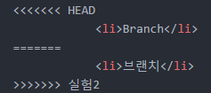
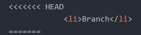
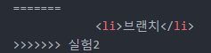
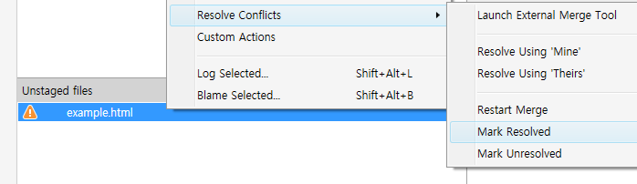

# 충돌 해결하기
> git의 GUI 프로그램인 sourcetree 기준으로 작성합니다.

## 브랜치 간의 충돌
각각 다른 브랜치가 같은 부분을 수정한 후 합치면 충돌이 발생한다. 수정한 파일로 가보면
```git
  <<<<<<< HEAD
    블라블라
  =======
    블라블라
  >>>>>>> 브랜치명
```

이렇게 되어 있다. `=======` 를 기준으로

위 쪽이 현재 체크아웃한(현재 위치한) 브랜치,

아래 쪽이 working 브랜치이다. 이건 혼자 작업한 것이라 브랜치 명이 뜨는데, 협업 시 충돌하면 영어+숫자(SHA-1 체크섬)가 뜬다. 그것은 theirs이다.
### 해결
밑의 것을 남기던, 위의 것을 남기던, 둘 다 남기던 `<<<<<<<` `=======` `>>>>>>>`을 지우고 파일 저장 후 소스트리로 돌아가면 `Unstaged files`쪽에 경고 표시가 되어 있다. 우클릭하여 `Resolve Conflicts`로 가서 `Mark Resolved`를 선택하면 된다. '내가 충돌을 해결했다'라는 뜻이다.

위의 사진에 보이는 `Resolve Using 'Mine'`은 나의 브랜치에 있던 내용을 채택하는 것이고, `Resolve Using 'Theirs'`는 내가 수정한 것을 삭제하고 병합한 브랜치의 내용을 채택하는 것이다.
