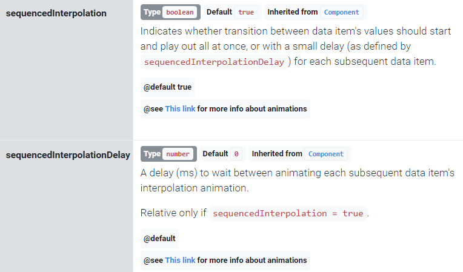

# amchart v4 스택 차트 렌더링이 느릴 때
- 스택 쌓일 데이터가 많은데, 한번에 그리려고 해서 그런지 너무 느림. 첨 사용하는거라 헤매다가 발견!
```javascript
	series.sequencedInterpolation = true;
```
### refer

- [amchart v4 docs > columnseries](https://www.amcharts.com/docs/v4/reference/columnseries/)
- [amchart v4 docs > animations](https://www.amcharts.com/docs/v4/concepts/animations/)
