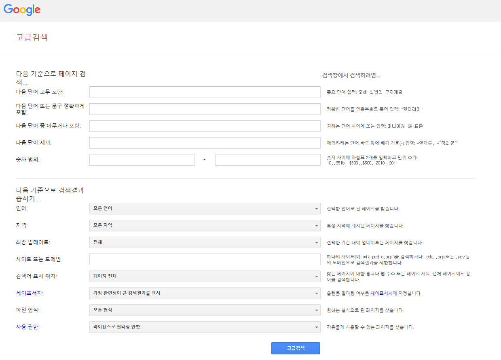

# 구글 검색 팁
- **날씨** : 현재 위치의 날씨. 서울 날씨와 같이 도시 이름 추가 가능
- **의미** : 단어의 뜻이 궁금하면 단어 뒤에 의미 입력
- **3달러/유로** 와 같이 단위 변환 검색어 입력
- **@** : 소셜 미디어에서 검색 `ex)@twitter`
- **$** : 가격 검색 `ex)카메라 $400`
- **#** : 해시태그 검색
- **-** : 제외할 단어 앞에 - 입력 `ex)재규어 속도 -차`
- **+** : 포함할 단어 앞에 - 입력 `ex)재규어 속도 +차`
- **""** : 정확히 일치하는 단어 검색 `ex)"가장 높은 빌딩"`
- **\*** : 알 수 없는 단어 검색 `ex)"세상에서 가장 큰 *"`
- **.****.** : 숫자 범위 내 검색 `ex)카메라$50..$100`
- **OR** : 검색어 조합 `ex)마라톤 OR 경주`
- **site:** : 특정 사이트 검색 `ex)site:.gov site:youtube.com`
- **site:~/ ~** : 특정 사이트 내 검색 `ex)site:youtube.com/ overwatch`
- **filetype:** : 지정한 확장자로 된 파일 검색 `ex)xls 가계부`
- **related:** : 관련 사이트 검색 `ex)related:time.com`
- **info:** : 사이트 세부 정보
- **cache:** : 구글에서 캐시한 사이트 버전 확인
### 귀찮다면 ..
[Google 고급검색](https://www.google.com/advanced_search)  
▼ 위 링크로 들어가면 이런 편리한 화면의 도움을 받아 고급 검색 가능 :)

### refer
[구글 고객센터 - 더 정확한 웹 검색결과 얻기](https://support.google.com/websearch/answer/2466433)
